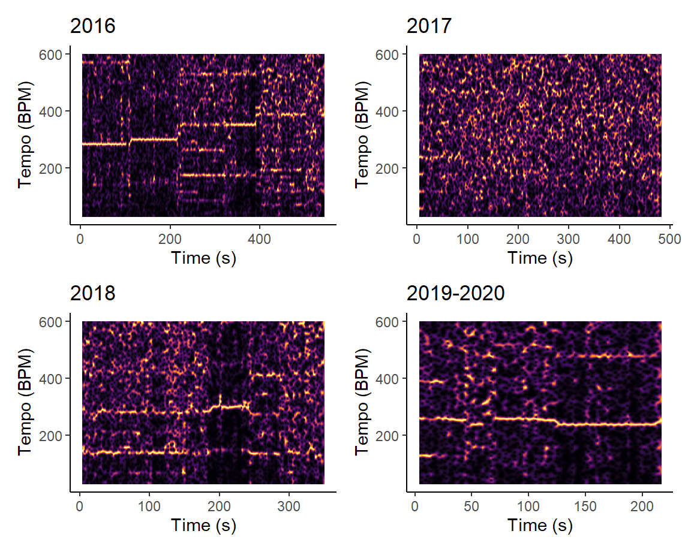
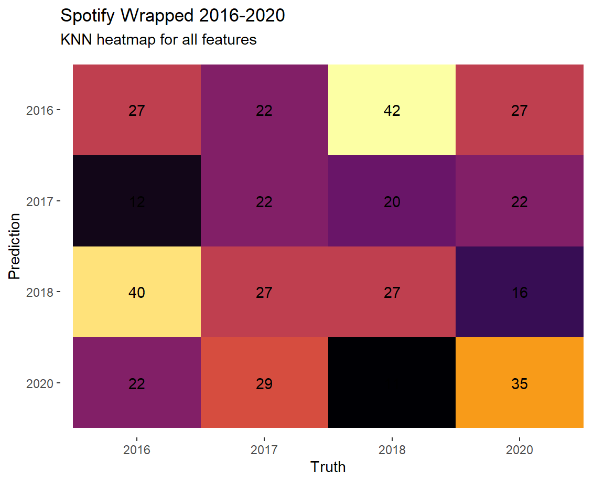
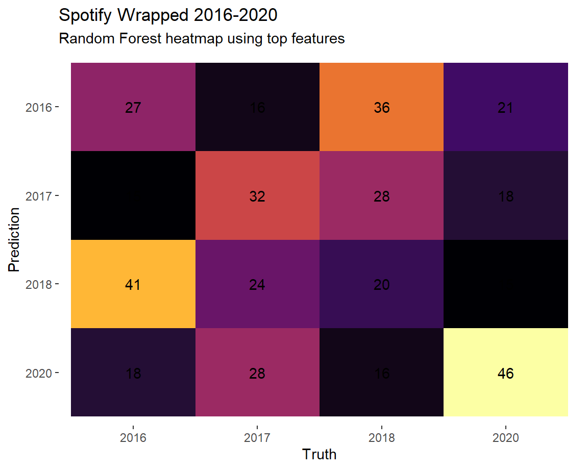
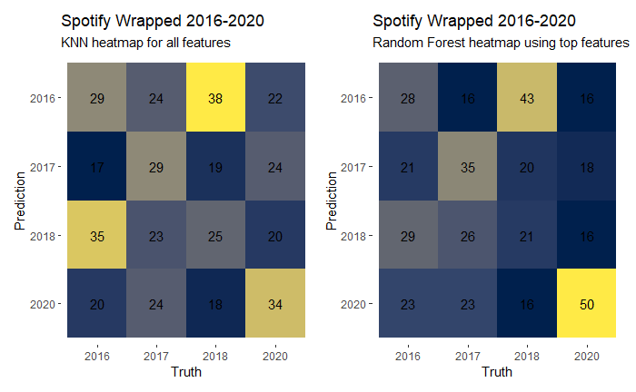
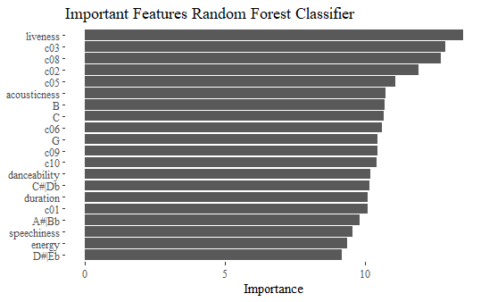

```{r setup, include=FALSE, echo=FALSE, message=FALSE}
knitr::opts_chunk$set(message = FALSE, echo = FALSE)

library(tidyverse)
library(spotifyr)
library(ggfortify)
library(flexdashboard)
library(readr)
library(lubridate)
library(ggplot2)
library(plotly)
library(compmus)
library(ggthemes)
library(patchwork)
library(ggdendro)
library(heatmaply)
library(tidymodels)
library(gridExtra)
library(grid)
sebas <- get_playlist_audio_features("", "5zSzru2LrIR0o8SUyLelyd")

sebas <- sebas %>%
  filter(!is.na(key))

wrapped16 <- get_playlist_audio_features("", "37i9dQZF1Cz24RS3exilwM") %>% filter(!is.na(key))
wrapped17 <- get_playlist_audio_features("", "37i9dQZF1E9Jzat5fcogxI") %>% filter(!is.na(key))
wrapped18 <- get_playlist_audio_features("", "37i9dQZF1EjvCrCRRFYOR7") %>% filter(!is.na(key))
wrapped19 <- get_playlist_audio_features("", "37i9dQZF1Etlshd0CHSHbz") %>% filter(!is.na(key))
wrapped20 <- get_playlist_audio_features("", "37i9dQZF1EMdGOBLndfzlm") %>% filter(!is.na(key))

get_conf_mat <- function(fit) {
  outcome <- .get_tune_outcome_names(fit)
  fit %>%
    collect_predictions() %>%
    conf_mat(truth = outcome, estimate = .pred_class)
}

get_pr <- function(fit) {
  fit %>%
    conf_mat_resampled() %>%
    group_by(Prediction) %>% mutate(precision = Freq / sum(Freq)) %>%
    group_by(Truth) %>% mutate(recall = Freq / sum(Freq)) %>%
    ungroup() %>% filter(Prediction == Truth) %>%
    select(class = Prediction, precision, recall)
}

```

```{r prepro wrapped, include=FALSE, echo=FALSE, message=FALSE}
wrapped_16_20 <-
  bind_rows(
    wrapped16 %>% mutate(category = "2016", playlist = '2016'),
    wrapped17 %>% mutate(category = "2017", playlist = '2017'),
    wrapped18 %>% mutate(category = "2018", playlist = '2018'),
    wrapped19 %>% mutate(category = "2019", playlist = '2019'),
    wrapped20 %>% mutate(category = "2020", playlist = '2020')
  )
#
# wrapped_16_20less <-
#   bind_rows(
#     wrapped16 %>% mutate( playlist = 'wrapped 2016') %>% slice_head(n = 25),
#     wrapped17 %>% mutate( playlist = 'wrapped 2017') %>% slice_head(n = 25),
#     wrapped18 %>% mutate( playlist = 'wrapped 2018') %>% slice_head(n = 25),
#     #wrapped19 %>% mutate( playlist = 'wrapped 2019') %>% slice_head(n = 10),
#     wrapped20 %>% mutate( playlist = 'wrapped 2020') %>% slice_head(n = 25)
#   )

wrapped_16_20class <-
  bind_rows(
    wrapped16 %>% mutate( playlist = '2016')  ,
    wrapped17 %>% mutate( playlist = '2017')  ,
    wrapped18 %>% mutate( playlist = '2018')  ,
    #wrapped19 %>% mutate( playlist = 'wrapped 2019')  ,
    wrapped20 %>% mutate( playlist = '2020')
)
```

``` {r chromas, include = FALSE, echo=FALSE, message=FALSE}
FLS <-
  get_tidy_audio_analysis("7p4vHnYXkxlzvfePJVpcTr") %>% 
  select(segments) %>%
  unnest(segments) %>%
  select(start, duration, pitches)


FLSCHROMA <- FLS %>%
  mutate(pitches = map(pitches, compmus_normalise, "euclidean")) %>%
  compmus_gather_chroma() %>% 
  ggplot(
    aes(
      x = start + duration / 2,
      width = duration,
      y = pitch_class,
      fill = value
    )
  ) +
  geom_tile() +
  labs(x = "Time (s)", y = NULL, fill = "Magnitude") +
  scale_fill_viridis_c(option="inferno") +
  theme_classic() +
  ggtitle("Feels Like Summer - Childish Gambino") 

FLS2 <-
  get_tidy_audio_analysis("7p4vHnYXkxlzvfePJVpcTr") %>%
  compmus_align(bars, segments) %>%
  select(bars) %>%
  unnest(bars) %>%
  mutate(
    pitches =
      map(segments,
        compmus_summarise, pitches,
        method = "acentre", norm = "manhattan"
      )
  ) %>%
  mutate(
    timbre =
      map(segments,
        compmus_summarise, timbre,
        method = "mean"
      )
  )
bind_rows(
  FLS2 %>%
    compmus_self_similarity(pitches, "aitchison") %>%
    mutate(d = d / max(d), type = "Chroma"),
  FLS2 %>%
    compmus_self_similarity(timbre, "euclidean") %>%
    mutate(d = d / max(d), type = "Timbre")
) %>%
  mutate() %>%
  ggplot(
    aes(
      x = xstart + xduration / 2,
      width = xduration,
      y = ystart + yduration / 2,
      height = yduration,
      fill = d
    )
  ) +
  geom_tile() +
  coord_fixed() +
  facet_wrap(~type) +
  scale_fill_viridis_c(guide = "none") +
  theme_classic() +
  labs(x = "", y = "")


circshift <- function(v, n) {
  if (n == 0) v else c(tail(v, n), head(v, -n))
}
#      C     C#    D     Eb    E     F     F#    G     Ab    A     Bb    B
major_chord <-
  c(   1,    0,    0,    0,    1,    0,    0,    1,    0,    0,    0,    0)
minor_chord <-
  c(   1,    0,    0,    1,    0,    0,    0,    1,    0,    0,    0,    0)
seventh_chord <-
  c(   1,    0,    0,    0,    1,    0,    0,    1,    0,    0,    1,    0)
major_key <-
  c(6.35, 2.23, 3.48, 2.33, 4.38, 4.09, 2.52, 5.19, 2.39, 3.66, 2.29, 2.88)
minor_key <-
  c(6.33, 2.68, 3.52, 5.38, 2.60, 3.53, 2.54, 4.75, 3.98, 2.69, 3.34, 3.17)
chord_templates <-
  tribble(
    ~name, ~template,
    "Gb:7", circshift(seventh_chord, 6),
    "Gb:maj", circshift(major_chord, 6),
    "Bb:min", circshift(minor_chord, 10),
    "Db:maj", circshift(major_chord, 1),
    "F:min", circshift(minor_chord, 5),
    "Ab:7", circshift(seventh_chord, 8),
    "Ab:maj", circshift(major_chord, 8),
    "C:min", circshift(minor_chord, 0),
    "Eb:7", circshift(seventh_chord, 3),
    "Eb:maj", circshift(major_chord, 3),
    "G:min", circshift(minor_chord, 7),
    "Bb:7", circshift(seventh_chord, 10),
    "Bb:maj", circshift(major_chord, 10),
    "D:min", circshift(minor_chord, 2),
    "F:7", circshift(seventh_chord, 5),
    "F:maj", circshift(major_chord, 5),
    "A:min", circshift(minor_chord, 9),
    "C:7", circshift(seventh_chord, 0),
    "C:maj", circshift(major_chord, 0),
    "E:min", circshift(minor_chord, 4),
    "G:7", circshift(seventh_chord, 7),
    "G:maj", circshift(major_chord, 7),
    "B:min", circshift(minor_chord, 11),
    "D:7", circshift(seventh_chord, 2),
    "D:maj", circshift(major_chord, 2),
    "F#:min", circshift(minor_chord, 6),
    "A:7", circshift(seventh_chord, 9),
    "A:maj", circshift(major_chord, 9),
    "C#:min", circshift(minor_chord, 1),
    "E:7", circshift(seventh_chord, 4),
    "E:maj", circshift(major_chord, 4),
    "G#:min", circshift(minor_chord, 8),
    "B:7", circshift(seventh_chord, 11),
    "B:maj", circshift(major_chord, 11),
    "D#:min", circshift(minor_chord, 3)
  )
key_templates <-
  tribble(
    ~name, ~template,
    "Gb:maj", circshift(major_key, 6),
    "Bb:min", circshift(minor_key, 10),
    "Db:maj", circshift(major_key, 1),
    "F:min", circshift(minor_key, 5),
    "Ab:maj", circshift(major_key, 8),
    "C:min", circshift(minor_key, 0),
    "Eb:maj", circshift(major_key, 3),
    "G:min", circshift(minor_key, 7),
    "Bb:maj", circshift(major_key, 10),
    "D:min", circshift(minor_key, 2),
    "F:maj", circshift(major_key, 5),
    "A:min", circshift(minor_key, 9),
    "C:maj", circshift(major_key, 0),
    "E:min", circshift(minor_key, 4),
    "G:maj", circshift(major_key, 7),
    "B:min", circshift(minor_key, 11),
    "D:maj", circshift(major_key, 2),
    "F#:min", circshift(minor_key, 6),
    "A:maj", circshift(major_key, 9),
    "C#:min", circshift(minor_key, 1),
    "E:maj", circshift(major_key, 4),
    "G#:min", circshift(minor_key, 8),
    "B:maj", circshift(major_key, 11),
    "D#:min", circshift(minor_key, 3)
  )
Build_God <-
  get_tidy_audio_analysis("7MMOPTjs6nZL0wf6C9ECKX") %>%
  compmus_align(bars, segments) %>%
  select(bars) %>%
  unnest(bars) %>%
  mutate(
    pitches =
      map(segments,
        compmus_summarise, pitches,
        method = "mean", norm = "manhattan"
      )
  )
Buildplot <- Build_God %>% 
  compmus_match_pitch_template(
    key_templates,         
    method = "euclidean",  
    norm = "manhattan"     
  ) %>%
  ggplot(
    aes(x = start + duration / 2, width = duration, y = name, fill = d)
  ) +
  geom_tile() +
  scale_fill_viridis_c(guide = "none",option = "inferno")  +
  labs(x = "Time (s)", y = "") +
  theme_classic() +
  ggtitle("2019-2020 ")

Bohem <-
  get_tidy_audio_analysis("1AhDOtG9vPSOmsWgNW0BEY") %>%
  compmus_align(bars, segments) %>%
  select(bars) %>%
  unnest(bars) %>%
  mutate(
    pitches =
      map(segments,
        compmus_summarise, pitches,
        method = "mean", norm = "manhattan"
      )
  )

Bohemplot <- Bohem %>% 
  compmus_match_pitch_template(
    key_templates,         
    method = "euclidean",  
    norm = "manhattan"     
  ) %>%
  ggplot(
    aes(x = start + duration / 2, width = duration, y = name, fill = d)
  ) +
  geom_tile() +
  scale_fill_viridis_c(guide = "none",option = "inferno")  +
  labs(x = "Time (s)", y = "") +
  theme_classic() +
  ggtitle("2018")

Weight <-
  get_tidy_audio_analysis("2UZZtkoLOg7IHxeTAdPFvd") %>%
 compmus_align(bars, segments) %>%
  select(bars) %>%
  unnest(bars) %>%
  mutate(
    pitches =
      map(segments,
        compmus_summarise, pitches,
        method = "mean", norm = "manhattan"
      )
  )

Wplot <- Weight %>% 
  compmus_match_pitch_template(
    key_templates,         
    method = "euclidean",  
    norm = "manhattan"     
  ) %>%
  ggplot(
    aes(x = start + duration / 2, width = duration, y = name, fill = d)
  ) +
  geom_tile() +
  scale_fill_viridis_c(guide = "none",option = "inferno")  +
  labs(x = "Time (s)", y = "") +
  theme_classic() +
  ggtitle("2017")

Sub <-
  get_tidy_audio_analysis("10lT3pp9QERGOWiIzLx4We") %>%
  compmus_align(sections, segments) %>%
  select(sections) %>%
  unnest(sections) %>%
  mutate(
    pitches =
      map(segments,
        compmus_summarise, pitches,
        method = "mean", norm = "manhattan"
      )
  )

Suburplot <- Sub %>% 
  compmus_match_pitch_template(
    key_templates,         
    method = "euclidean",  
    norm = "manhattan"     
  ) %>%
  ggplot(
    aes(x = start + duration / 2, width = duration, y = name, fill = d)
  ) +
  geom_tile() +
  scale_fill_viridis_c(guide = "none",option = "inferno") +
  labs(x = "Time (s)", y = "") +
  theme_classic() +
  ggtitle("2016")

```

```{r tempograms, include = FALSE, echo=FALSE, message=FALSE}
# build_temp <- get_tidy_audio_analysis("7MMOPTjs6nZL0wf6C9ECKX") 
# sub_temp <- get_tidy_audio_analysis("10lT3pp9QERGOWiIzLx4We")
# bohem_temp <- get_tidy_audio_analysis("1AhDOtG9vPSOmsWgNW0BEY")
# weight_temp <- get_tidy_audio_analysis("2UZZtkoLOg7IHxeTAdPFvd")
# 
# tempbuild <- build_temp %>%
#   tempogram(window_size = 8, hop_size = 1, cyclic = FALSE) %>%
#   ggplot(aes(x = time, y = bpm, fill = power)) +
#   geom_raster() +
#   scale_fill_viridis_c(guide = "none", option = "inferno") +
#   labs(x = "Time (s)", y = "Tempo (BPM)") +
#   ggtitle("2019-2020") +
#   theme_classic()
# 
# tempsub <- sub_temp %>%
#   tempogram(window_size = 8, hop_size = 1, cyclic = FALSE) %>%
#   ggplot(aes(x = time, y = bpm, fill = power)) +
#   geom_raster() +
#   scale_fill_viridis_c(guide = "none", option = "inferno") +
#   labs(x = "Time (s)", y = "Tempo (BPM)") +
#   ggtitle("2016") +
#   theme_classic()
# 
# tempweight <- weight_temp %>%
#   tempogram(window_size = 8, hop_size = 1, cyclic = FALSE) %>%
#   ggplot(aes(x = time, y = bpm, fill = power)) +
#   geom_raster() +
#   scale_fill_viridis_c(guide = "none", option = "inferno") +
#   labs(x = "Time (s)", y = "Tempo (BPM)") +
#   ggtitle("2017") +
#   theme_classic()
# 
# tempbohem <- bohem_temp %>%
#   tempogram(window_size = 8, hop_size = 1, cyclic =FALSE) %>%
#   ggplot(aes(x = time, y = bpm, fill = power)) +
#   geom_raster() +
#   scale_fill_viridis_c(guide = "none", option = "inferno") +
#   labs(x = "Time (s)", y = "Tempo (BPM)") +
#   ggtitle("2018") +
#   theme_classic()
# 

# 
# build_temp <- get_tidy_audio_analysis("7MMOPTjs6nZL0wf6C9ECKX") %>%
# select(segments) %>%
# unnest(segments)
# 
# sub_temp <- get_tidy_audio_analysis("10lT3pp9QERGOWiIzLx4We") %>%
# select(segments) %>%
# unnest(segments)
# 
# bohem_temp <- get_tidy_audio_analysis("1AhDOtG9vPSOmsWgNW0BEY") %>%
# select(segments) %>%
# unnest(segments)
# 
# weight_temp <- get_tidy_audio_analysis("2UZZtkoLOg7IHxeTAdPFvd") %>%
# select(segments) %>%
# unnest(segments)
# 
# 
# 
# novelgod <- build_temp %>%
#   mutate(loudness_max_time = start + loudness_max_time) %>%
#   arrange(loudness_max_time) %>%
#   mutate(delta_loudness = loudness_max - lag(loudness_max)) %>%
#   ggplot(aes(x = loudness_max_time, y = pmax(0, delta_loudness))) +
#   geom_line() +
#   xlim(50, 130) +
#    ggtitle("2019/2020") +
#   theme_minimal() +
#   labs(x = "Time (s)", y = "Novelty")
# 
# novelbohem <- bohem_temp %>%
#   mutate(loudness_max_time = start + loudness_max_time) %>%
#   arrange(loudness_max_time) %>%
#   mutate(delta_loudness = loudness_max - lag(loudness_max)) %>%
#   ggplot(aes(x = loudness_max_time, y = pmax(0, delta_loudness))) +
#   geom_line() +
#   xlim(180, 250) +
#   theme_minimal() +
#    ggtitle("2018") +
#   labs(x = "Time (s)", y = "Novelty")
# 
# novelsub<- sub_temp %>%
#  mutate(loudness_max_time = start + loudness_max_time) %>%
#   arrange(loudness_max_time) %>%
#   mutate(delta_loudness = loudness_max - lag(loudness_max)) %>%
#   ggplot(aes(x = loudness_max_time, y = pmax(0, delta_loudness))) +
#   geom_line() +
#   xlim(100, 220) +
#   theme_minimal() +
#    ggtitle("2016") +
#   labs(x = "Time (s)", y = "Novelty")
# 
# novelweight <- weight_temp %>%
#   mutate(loudness_max_time = start + loudness_max_time) %>%
#   arrange(loudness_max_time) %>%
#   mutate(delta_loudness = loudness_max - lag(loudness_max)) %>%
#   ggplot(aes(x = loudness_max_time, y = pmax(0, delta_loudness))) +
#   geom_line() +
#   xlim(0, 30) +
#   theme_minimal() +
#    ggtitle("2017") +
#   labs(x = "Time (s)", y = "Novelty")

``` 


``` {r graphs, include = FALSE, echo=FALSE, message=FALSE}


valendancepopyear <- wrapped_16_20 %>%
 ggplot(                          # Set up the plot.
    aes(
      x = danceability,
      y = energy,
      size = 1,
      color = valence,
      label = track.name           # Labels will be interactively visible.
    )
  ) +
  geom_point(alpha=0.7) +                   # Scatter plot.
  geom_rug(size = 0.1) +           # Add 'fringes' to show data distribution.
  facet_wrap(~category) +           # Separate charts per country.
  scale_x_continuous(              # Fine-tune the x axis.
    limits = c(0, 1),
    breaks = c(0, 0.50, 1),        # Use grid-lines for quadrants only.
    minor_breaks = NULL            # Remove 'minor' grid-lines.
  ) +
  scale_y_continuous(              # Fine-tune the y axis in the same way.
    limits = c(0, 1),
    breaks = c(0, 0.50, 1),
    minor_breaks = NULL
  ) +
  scale_color_viridis_c(option="inferno") +
  theme_tufte() +                 # Use a simpler theme.
  labs(                            # Make the titles nice.
    x = "Danceability",
    y = "Energy"
  ) 

```


```{r hists/bars, include=FALSE, echo=FALSE, message=FALSE}

keyfreqyear <- wrapped_16_20 %>%
ggplot(aes(x = factor(key_name), fill = mode_name)) +
  geom_bar() +
  xlab("Keys") +
  ylab("Frequency")+
  ggtitle("Key frequency wrapped 2016-2020") +
  theme_tufte() +
  scale_fill_discrete(guide=FALSE) +
  facet_wrap(~category)

modefreqyear <- wrapped_16_20 %>%
  ggplot(aes(x = factor(mode))) +
  geom_bar() +
  xlab("Mode (factored)") +
  ylab("Frequency")+
  ggtitle("Mode Spotify wrapped per year") +
  scale_x_discrete(labels=c("0" = "Minor", "1" = "Major")) +
  theme_tufte() +
  facet_wrap(~category)

valdens <-  wrapped_16_20 %>%
  ggplot(aes( x = valence)) +
   geom_histogram(aes(y=..density..),      # Histogram with density instead of count on y-axis
                   binwidth=.5,
                   colour="black", fill="white") +
    geom_density( alpha=.2, fill="#FF6666")  + # Overlay with transparent density plot
  facet_wrap(~category) +
  theme_tufte() 

yearenergy <-  wrapped_16_20 %>%
  ggplot(aes( x = energy)) +
   geom_histogram(aes(stat = "bin", y=..density..),      # Histogram with density instead of count on y-axis
                   binwidth=.5,
                   colour="black", fill="white") +
    geom_density( alpha=.2, fill="#FF6666")  + # Overlay with transparent density plot
  facet_wrap(~category) +
  theme_tufte() 

yearloudness <-  wrapped_16_20 %>%
  ggplot(aes( x = loudness)) +
   geom_histogram(aes(stat = "bin", y=..density..),      # Histogram with density instead of count on y-axis
                   binwidth=.5,
                   colour="black", fill="white") +
    geom_density( alpha=.2, fill="#FF6666")  + # Overlay with transparent density plot
  facet_wrap(~category) +
  theme_tufte() 


yeardanceability <-  wrapped_16_20 %>%
  ggplot(aes( x = danceability)) +
   geom_histogram(aes(stat = "bin", y=..density..),      # Histogram with density instead of count on y-axis
                   binwidth=.5,
                   colour="black", fill="white") +
    geom_density( alpha=.2, fill="#FF6666")  + # Overlay with transparent density plot
  facet_wrap(~category) +
  theme_tufte() 

yearacousticness <-  wrapped_16_20 %>%
  ggplot(aes( x = acousticness)) +
   geom_histogram(aes(stat = "bin", y=..density..),      # Histogram with density instead of count on y-axis
                   binwidth=.5,
                   colour="black", fill="white") +
    geom_density( alpha=.2, fill="#FF6666")  + # Overlay with transparent density plot
  facet_wrap(~category) +
  theme_tufte() 

yearinstrumentalness <-  wrapped_16_20 %>%
  ggplot(aes( x = instrumentalness)) +
  geom_histogram(binwidth=.5,colour="black", fill="white") +
  facet_wrap(~category) +
  theme_tufte() 

histtempo <-  wrapped_16_20 %>%
  ggplot(aes( x = tempo)) +
   geom_histogram(aes( y=..density..),      # Histogram with density instead of count on y-axis
                   colour="black", fill="white") +
    geom_density( alpha=.2, fill="#FF6666")  + # Overlay with transparent density plot
  facet_wrap(~category) +
   labs(x = "Tempo (BPM)", y = "Density")
  theme_tufte() 


```

<!-- ```{r class prepro, include=FALSE, echo=FALSE, message=FALSE} -->


<!-- wrapped_features <- -->
<!--  wrapped_16_20class %>%  # For your portfolio, change this to the name of your corpus. -->
<!--   add_audio_analysis() %>% -->
<!--   mutate( -->
<!--     playlist = factor(playlist), -->
<!--     segments = map2(segments, key, compmus_c_transpose), -->
<!--     pitches = -->
<!--       map( -->
<!--         segments, -->
<!--         compmus_summarise, pitches, -->
<!--         method = "mean", norm = "manhattan" -->
<!--       ), -->
<!--     timbre = -->
<!--       map( -->
<!--         segments, -->
<!--         compmus_summarise, timbre, -->
<!--         method = "mean", -->
<!--       ) -->
<!--   ) %>% -->
<!--   mutate(pitches = map(pitches, compmus_normalise, "clr")) %>% -->
<!--   mutate_at(vars(pitches, timbre), map, bind_rows) %>% -->
<!--   unnest(cols = c(pitches, timbre)) -->


<!-- # prepro -->

<!-- wrappedcipe <- -->
<!--   recipe( -->
<!--     playlist ~ -->
<!--       danceability + -->
<!--       energy + -->
<!--       loudness + -->
<!--       speechiness + -->
<!--       acousticness + -->
<!--       instrumentalness + -->
<!--       liveness + -->
<!--       valence + -->
<!--       tempo + -->
<!--       duration + -->
<!--       C + `C#|Db` + D + `D#|Eb` + -->
<!--       E + `F` + `F#|Gb` + G + -->
<!--       `G#|Ab` + A + `A#|Bb` + B + -->
<!--       c01 + c02 + c03 + c04 + c05 + c06 + -->
<!--       c07 + c08 + c09 + c10 + c11 + c12, -->
<!--     data = wrapped_features,          # Use the same name as the previous block. -->
<!--   ) %>% -->
<!--   step_center(all_predictors()) %>% -->
<!--   step_scale(all_predictors())      # Converts to z-scores. -->
<!--   # step_range(all_predictors())    # Sets range to [0, 1]. -->


<!-- ``` -->


<!-- ```{r class, include=FALSE, echo=FALSE, message=FALSE} -->
<!-- wrapped_cv <- wrapped_features %>% vfold_cv(5) -->

<!-- knn_model <- -->
<!--   nearest_neighbor(neighbors = 1) %>% -->
<!--   set_mode("classification") %>% -->
<!--   set_engine("kknn") -->
<!-- wrapped_knn <- -->
<!--   workflow() %>% -->
<!--   add_recipe(wrappedcipe) %>% -->
<!--   add_model(knn_model) %>% -->
<!--   fit_resamples( -->
<!--     wrapped_cv, -->
<!--     control = control_resamples(save_pred = TRUE) -->
<!--     ) -->
<!-- ``` -->


<!-- ```{r trees, include=FALSE, echo=FALSE, message=FALSE} -->

<!-- tree_model <- -->
<!--   decision_tree() %>% -->
<!--   set_mode("classification") %>% -->
<!--   set_engine("C5.0") -->
<!-- wrapped_tree <- -->
<!--   workflow() %>% -->
<!--   add_recipe(wrappedcipe) %>% -->
<!--   add_model(tree_model) %>% -->
<!--   fit_resamples( -->
<!--     wrapped_cv, -->
<!--     control = control_resamples(save_pred = TRUE) -->
<!--   ) -->
<!-- ``` -->

<!-- ```{r forest, include=FALSE, echo=FALSE, message=FALSE} -->
<!-- forestcipe <- -->
<!--   recipe( -->
<!--     playlist ~ -->
<!--       danceability + -->
<!--       energy + -->
<!--       speechiness + -->
<!--       acousticness + -->
<!--       liveness + -->
<!--       duration + -->
<!--       C + `C#|Db` +  `D#|Eb` + -->
<!--        G + `A#|Bb` + B + -->
<!--       c01 + c02 + c03 + c05 + c06 + -->
<!--        c08 + c09 + c10 , -->
<!--     data = wrapped_features,          # Use the same name as the previous block. -->
<!--   ) %>% -->
<!--   step_center(all_predictors()) %>% -->
<!--   step_scale(all_predictors())      # Converts to z-scores. -->
<!--   # step_range(all_predictors())    # Sets range to [0, 1]. -->


<!-- forest_model <- -->
<!--   rand_forest() %>% -->
<!--   set_mode("classification") %>% -->
<!--   set_engine("ranger", importance = "impurity") -->
<!-- wrapped_forest <- -->
<!--   workflow() %>% -->
<!--   add_recipe(forestcipe) %>% -->
<!--   add_model(forest_model) %>% -->
<!--   fit_resamples( -->
<!--     wrapped_cv, -->
<!--     control = control_resamples(save_pred = TRUE) -->
<!--   ) -->

<!-- forest_feat <- workflow() %>% -->
<!--   add_recipe(forestcipe) %>% -->
<!--   add_model(forest_model) %>% -->
<!--   fit(wrapped_features) %>% -->
<!--   pluck("fit", "fit", "fit") %>% -->
<!--   ranger::importance() %>% -->
<!--   enframe() %>% -->
<!--   mutate(name = fct_reorder(name, value)) %>% -->
<!--   ggplot(aes(name, value)) + -->
<!--   geom_col() + -->
<!--   coord_flip() + -->
<!--   theme_tufte() + -->
<!--   labs(x = NULL, y = "Importance", title =  "Important Features Random Forest Classifier ") -->
<!-- ``` -->


### Introduction


#### Spotify Wrapped 2016-2020
Every december Spotify makes you a "wrapped" playlist of the 100 songs you most frequently listened to that year giving a clear picture of your music taste that year. I've always found that my music taste is kind of variable with a lot of different genre's so it would be interesting to see how my music taste has changed from 2016 till now. To compare my music taste from 2016 to 2020 i will analyze my Spotify wrapped 2016-2020 playlists using the following metrics: **valence, danceability, energy, tempo, key** and **modality.**

After getting a global idea i'd like to take one favorite song from each year which i will compare in more depth, using the metrics mentioned above and chroma/timbregrams to look at similarities/differences. (WIP)

#### Corpus:

My Corpus is divided into 5 groups of spotify wrapped playlists representing 2016 to 2020:

[Wrapped 2016](https://open.spotify.com/playlist/37i9dQZF1Cz24RS3exilwM?si=ZOze5nWySsWErYrc3xVM4Q)

[Wrapped 2017](https://open.spotify.com/playlist/37i9dQZF1E9Jzat5fcogxI?si=1ehaYOK2QXaN7Zj5addPPw)

[Wrapped 2018](https://open.spotify.com/playlist/37i9dQZF1EjvCrCRRFYOR7?si=Yr8yJlFfTmCiSsGq3JJtWQ)

[Wrapped 2019](https://open.spotify.com/playlist/37i9dQZF1Etlshd0CHSHbz?si=WTbkaVjySZizef_MzektQA)

[Wrapped 2020](https://open.spotify.com/playlist/37i9dQZF1EMdGOBLndfzlm?si=yB3xeK53Trqhc_xIE69a3A)


### Because I'm Happy...? (Valence density plot)

```{r echo=FALSE, message=FALSE}
ggplotly(valdens)

```

***

* You can clearly see that most of my favorite songs in 2016, 2017 and 2018 were "happier" than my most favorite songs in 2019 and 2020. Although 2019 has some outliers with music used for sleeping which all have a really low valence score.


### Multivariate Musicology (Valence, energy, danceability)

```{r echo=FALSE, message=FALSE}
ggplotly(valendancepopyear)

```


***

* My music from 2016-2020 has generally become more and more danceable every year shifting to the right until in 2020 almost all songs have a danceability higher than 0.4. The energy distribution stays more or less the same every year.

* As mentioned in the previous tab you can see the music used for sleeping in the 2019 plot at the bottom left it has a clear low score on just about every variable.


### Time (Tempo histogram with density) 

```{r echo=FALSE, message=FALSE}
ggplotly(histtempo)
```

***

* The tempo of the songs in my spotify wrapped playlists mostly seem to hang around 100-120 BPM this seems to conform to Moelants(2002) which suggests that humans prefer tempi around 120 BPM. Starting at 110 BPM in 2016 then 100 BPM in 2017/2018, shooting up to 120 BPM in 2019 and reverting back to 100 BPM in 2020.  


### And Time again (Tempograms for Favorites/Outliers)

#### Tempograms
```{r echo=FALSE, message=FALSE}



```

*** 

<object data="https://open.spotify.com/embed/track/58KPPL1AdLHMvR2O2PZejr" width="280" height="80">
    <embed src="https://open.spotify.com/embed/track/58KPPL1AdLHMvR2O2PZejr" width="280" height="80"></embed>
</object>

<object data="https://open.spotify.com/embed/track/2UZZtkoLOg7IHxeTAdPFvd" width="280" height="80">
    <embed src="https://open.spotify.com/embed/track/2UZZtkoLOg7IHxeTAdPFvd" width="280" height="80"></embed>
</object>

<object data="https://open.spotify.com/embed/track/3z8h0TU7ReDPLIbEnYhWZb" width="280" height="80">
    <embed src="https://open.spotify.com/embed/track/3z8h0TU7ReDPLIbEnYhWZb" width="280" height="80"></embed>
</object>

<object data="https://open.spotify.com/embed/track/7MMOPTjs6nZL0wf6C9ECKX" width="280" height="80">
    <embed src="https://open.spotify.com/embed/track/7MMOPTjs6nZL0wf6C9ECKX" width="280" height="80"></embed>
</object>

<!-- * 2016 Jesus of Suburbia - Green Day: an outlier because the song has lots of different sections and tempo changes. You can clearly see some of the different sections in the tempogram with tempo changes at 100, 200 and 400 seconds. However the bpm is way off starting at 300 BPM and almost reaching 400 at 400 seconds in. While the average BPM is around 147. -->


<!-- * 2017 Weightless part 1 - Marconi Union: an outlier because its sleep music and is not something i would listen to on the regular. As expected spotfity can't really figure out the tempo as this song is just atmospheric sounds without a distinct way to measure tempo. -->

<!-- * 2018 Bohemian Rhapsody - Queen: an outlier because it has different sections and tempo changes. You can clearly see the segment change where the staccato piano comes in and the tempo changes at around 180 seconds in and when the guitars solo's start at around 250 seconds in. Just as for every tempogram the tempo seems way off with the song having an average bpm of 72, while the tempogram shows 2 lines one at around 100-110 bpm and one at around 300 bpm possibly indicating that spotify has trouble identifying the tempo of songs that have these kinds of tempo changes. -->

<!-- * 2019/2020 Build God, Then We'll Talk - Panic! At The Disco: an outlier because it has different sections, tempo changes and time signature changes which makes this a very unique song. At 50 seconds in the time signature changes to a 3/4 and then reverts back to 4/4 after a small section then another time signature change just after the 1 minute mark explains the small gap in the line. Spotify correctly finds the tempo change at 130 seconds. Once again the BPM is totally wrong with this song having an average tempo of 124. -->

<!-- ```{=html} -->
<!-- <object data="https://open.spotify.com/embed/track/58KPPL1AdLHMvR2O2PZejr" width="280" height="140"> -->
<!--     <embed src="https://open.spotify.com/embed/track/58KPPL1AdLHMvR2O2PZejr" width="280" height="140"></embed> -->
<!-- </object> -->

<!-- <object data="https://open.spotify.com/embed/track/2UZZtkoLOg7IHxeTAdPFvd" width="280" height="140"> -->
<!--     <embed src="https://open.spotify.com/embed/track/2UZZtkoLOg7IHxeTAdPFvd" width="280" height="140"></embed> -->
<!-- </object> -->

<!-- <object data="https://open.spotify.com/embed/track/3z8h0TU7ReDPLIbEnYhWZb" width="280" height="140"> -->
<!--     <embed src="https://open.spotify.com/embed/track/3z8h0TU7ReDPLIbEnYhWZb" width="280" height="140"></embed> -->
<!-- </object> -->

<!-- <object data="https://open.spotify.com/embed/track/7MMOPTjs6nZL0wf6C9ECKX" width="280" height="140"> -->
<!--     <embed src="https://open.spotify.com/embed/track/7MMOPTjs6nZL0wf6C9ECKX" width="280" height="140"></embed> -->
<!-- </object> -->
<!-- ``` -->


### Acchordingly (Chordograms for Favorites/Outliers) 

```{r echo=FALSE, message=FALSE, figures-side, fig.show="hold", out.width="50%"}
Suburplot 
Wplot 
Bohemplot 
Buildplot
# plot_layout(ncol = 2)
```

***

* Outliers:

* 2016 Jesus of Suburbia - Green Day: an outlier because the song has lots of different sections and tempo changes.

* 2017 Weightless part 1 - Marconi Union: an outlier because its sleep music and is not something you would listen to on the regular.

* 2018 Bohemian Rhapsody - Queen: an outlier because it has different sections and tempo changes.

* 2019/2020 Build God, Then We'll Talk - Panic! At The Disco: an outlier because it has different sections and tempo changes.


### Keyp on moving (**Key Frequency**) 

```{r echo=FALSE, message=FALSE}
ggplotly(keyfreqyear)
```

***

* The key frequency doesn't change that much through the years other then flattening out a bit in 2017, 2019 and 2020. The mode seems fairly distributed between major and minor in most years except for 2018 where you can clearly see i listened to more songs with a major mode. 


### Feels like summer (**Chromagram**)

```{r echo=FALSE, message=FALSE}
plot(FLSCHROMA)
```

***

* Chromagram for the song i most frequently listened to. (under construction)

### Self-Similarity Matrices

```{r, echo = FALSE, message = FALSE}
library(tidyverse)
library(spotifyr)
library(compmus)
SelfSim_FLS <-
  get_tidy_audio_analysis("7p4vHnYXkxlzvfePJVpcTr") %>%
  compmus_align(bars, segments) %>%
  select(bars) %>%
  unnest(bars) %>%
  mutate(
    pitches =
      map(segments,
        compmus_summarise, pitches,
        method = "acentre", norm = "manhattan"
      )
  ) %>%
  mutate(
    timbre =
      map(segments,
        compmus_summarise, timbre,
        method = "mean"
      )
  )
bind_rows(
  SelfSim_FLS %>%
    compmus_self_similarity(pitches, "aitchison") %>%
    mutate(d = d / max(d), type = "Chroma"),
  SelfSim_FLS %>%
    compmus_self_similarity(timbre, "euclidean") %>%
    mutate(d = d / max(d), type = "Timbre")
) %>%
  mutate() %>%
  ggplot(
    aes(
      x = xstart + xduration / 2,
      width = xduration,
      y = ystart + yduration / 2,
      height = yduration,
      fill = d
    )
  ) +
  ggtitle("Feels Like Summer - Childish Gambino") +
  geom_tile() +
  coord_fixed() +
  facet_wrap(~type) +
  scale_fill_viridis_c(guide = "none",option = "inferno") +
  theme_classic() +
  labs(x = "", y = "")
```

***

* Chroma and Timbre self-similarity matrices for the song i most frequently listened to. At multiple segments in the song (at around 120, 300 and constantly during the outro) there is a section where most instruments fade out and come back in with Childish Gambino belting a high note, this could explain the intersections at those times in the chroma an timbre graphs. Whats interesting is that the timbre graph singles out the segment at 200 seconds. This is because not just some but all the other instruments stop for a moment as a opposed to earlier and later occurrences of a similar segment, resulting in the biggest difference in timbre.


### Wrapped Classification (**KNN, Random Forests**)


```{r classi, echo=FALSE, message=FALSE, fig.show="hold", out.width="50%"}
# knn <- wrapped_knn %>% get_conf_mat() %>%
#   autoplot(type = "heatmap") +
#   labs(title = "Spotify Wrapped 2016-2020", subtitle = "KNN heatmap for all features") +
#   scale_fill_viridis_c( guide = "none", option = "inferno")
# 
# 
# 
# # knn_feat
# 
# forest <- wrapped_forest %>% get_conf_mat() %>%
#   autoplot(type = "heatmap") +
#   labs(title = "Spotify Wrapped 2016-2020", subtitle = "Random Forest heatmap using top features") +
#   scale_fill_viridis_c(guide = "none", option = "inferno")



# knn 
# forest 
# plot_layout(ncol = 2)
# 


knn_stat <- matrix(c(0.2566372, 0.2871287, 0.3258427, 0.2900000, 0.2427184, 0.2500000, 0.3541667,	0.3400000), ncol=2, byrow=TRUE)
colnames(knn_stat) <- c("Precision","Recall")
rownames(knn_stat) <- c("2016","2017","2018","2020")

forest_stat <- matrix(c(0.2718447,	0.2772277, 0.3723404,	0.3500000, 0.2282609,	0.2100000, 0.4464286, 0.5000000), ncol=2, byrow=TRUE)
colnames(forest_stat) <- c("Precision","Recall")
rownames(forest_stat) <- c("2016","2017","2018","2020")

grid.arrange(gtable_combine(tableGrob(knn_stat),tableGrob(forest_stat)))


```

***

* 2019 was excluded due to errors.

* Overall the classifiers don't work very well for my corpus but i expected as much. Since i do listen to a lot of different music the algorithms might have trouble finding distinct features for every year the different years. However, with limited features on the random forest classifier 2016, 2017 and 2020 seem to be working a lot better, almost classifying 50% correctly. Another thing worth noting is the correlation between 2016 and 2018 for both classifiers. The classifiers keep labeling 2016 as 2018 and vice versa. The k-nearest neighbors classifier was trained on all of the features and the random forest trained only on the top half of the features from the feature importance plot.


